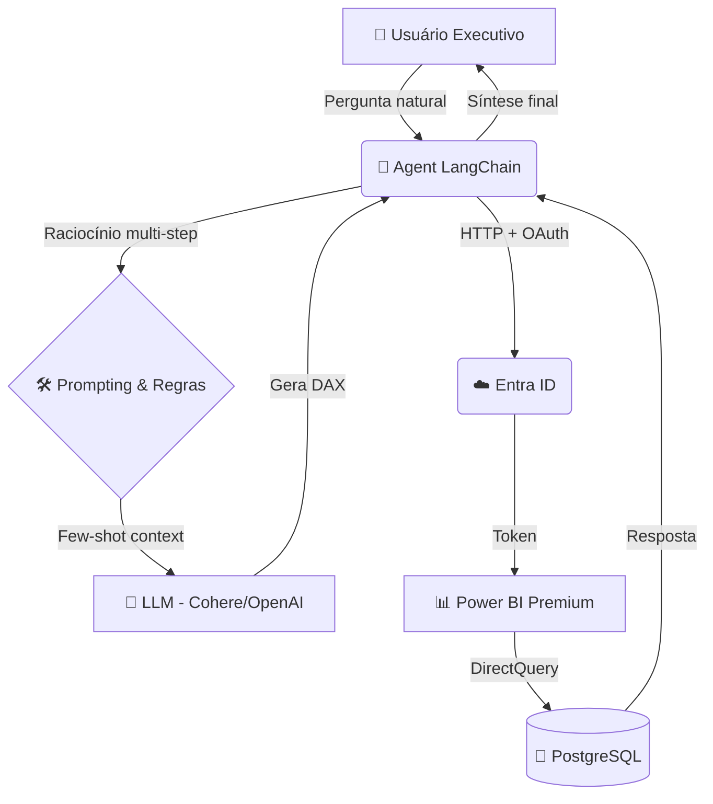

# 🤖 Agent Power BI (Chat2DAX)
> Interface conversacional inteligente baseada em LangChain para geração autônoma de consultas DAX em linguagem natural a partir de datasets do Power BI.

-0078D4?style=for-the-badge&logo=microsoftazure&logoColor=white)

---

## 📖 Visão Geral

A principal dor na análise de dados corporativos é a dependência de dashboards estáticos e o gargalo das equipes técnicas para responder perguntas específicas.

**E se executivos pudessem simplesmente conversar com os dados?**

Este projeto é uma **Prova de Conceito (PoC)** que integra:
- Toolkits do LangChain para Power BI  
- Modelos de linguagem (LLMs)  
- APIs REST do Azure  

O Agent atua como um **engenheiro de dados virtual**, capaz de:
- Interpretar linguagem natural  
- Planejar consultas  
- Gerar código DAX  
- Executar queries automaticamente  

---

## 🏗️ Arquitetura do Sistema

---

## ⚙️ Infraestrutura e Configuração

### 🔐 Identidade e Segurança
- Autenticação via Microsoft Entra ID
- Acesso programático M2M (Machine-to-Machine)
- Permissões granulares para API do Power BI

### 📊 Camada Semântica
- Dataset hospedado em Power BI Premium
- Workspace na nuvem Microsoft

### 🗄️ Dados
- Banco relacional em PostgreSQL
- Integração via DirectQuery
- Execução dinâmica de consultas DAX

### 📚 Dataset de Estudo
- Dados públicos de COVID-19 da Prefeitura de Curitiba  
- Processamento local em ambiente controlado  
- Nenhum dado sensível utilizado  

---

## 🧠 Engenharia de Prompt & Modelos

### 🔄 Evolução dos Modelos
- Inicial: OpenAI (GPT-3.5 / GPT-4)  
- Problema: custo e consumo de tokens em loops  
- Solução: migração para Cohere  

---

### ⚠️ Desafios Encontrados

#### Rate Limiting
- Limite: 10 requisições/minuto
- Impacto: falhas no Agent

#### Solução: Multi-Agent Controlado
- Limite de iterações (max_iterations = 5)
- Redução de loops desnecessários
- Maior estabilidade

---

### 🎯 Prompt Engineering

#### ❌ Zero-shot
- Respostas genéricas  
- Baixa precisão em DAX  

#### ✅ Few-shot
- Exemplos estruturados  
- Contexto técnico embutido  
- Maior assertividade na primeira execução  

---

### 🌐 Desafio Atual
- Latência multilíngue  
- Raciocínio interno em inglês  
- Interface final em português (pt-BR)  

---

## 💻 Ambiente de Testes

Infraestrutura baseada em créditos Azure (trial):

- Orçamento: R$ 1080  
- Período limitado  

### Recursos utilizados:
- Power BI Premium  
- PostgreSQL dedicado  
- Integração com Entra ID  
- Ambiente isolado (sandbox)  

### 🔐 Segurança dos Dados
- Apenas dados públicos  
- Sem risco de vazamento  
- Compatível com uso de LLMs abertas  

---

## 🚀 Roadmap para Ambiente Enterprise

### 🔄 Troca de Provider LLM
- Remoção de modelos open/shared  
- Uso de:
  - Azure OpenAI (Private Endpoint)  
  - Google Vertex AI  

---

### 🔒 Governança e Segurança
- SLAs formais de LLM  
- Opt-out de retenção de dados  
- Zero uso de dados para treinamento  
- Isolamento completo de queries  

---

### ⚙️ MLOps e Compliance
- Pipeline controlado  
- Auditoria de queries  
- Monitoramento de uso  
- Controle de custos  

---

## 💡 Status do Projeto

🚧 Em evolução contínua com foco em:
- Performance  
- Redução de latência  
- Melhor UX conversacional  
- Robustez empresarial  
